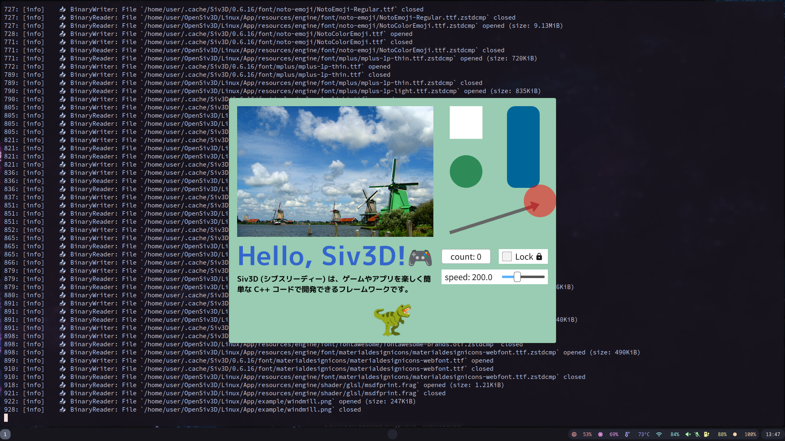

## Siv3D on Docker



### Usage

```bash
$ pwd
/home/user/OpenSiv3D/Linux
$ mkdir App/build
$ cd App/build
$ cmake -GNinja -DCMAKE_BUILD_TYPE=RelWithDebInfo ..
$ cd ..
$ cmake --build build
```

### References

- [Linux 版 Siv3D を Docker で動かしたい #C++ - Qiita](https://qiita.com/ogame0522/items/d6ab741ea9b5731cfad3)
